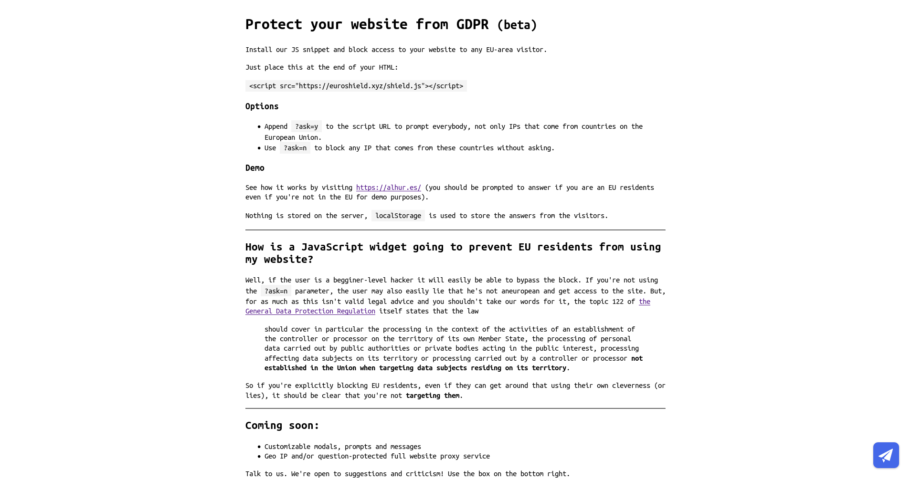

Screenshot of the old landing page:

Euroshield had almost 10 active webpages using it in its days of glory.

The idea was to use Cloudflare Workers to provide full site proxy to people who wanted more than just a super annoying popup.

I don't have a screenshot of the popup, but it was just a blue ugly thing with the awful EU flag on it and two buttons: "Are you from EU? yes / no", or something like that.
